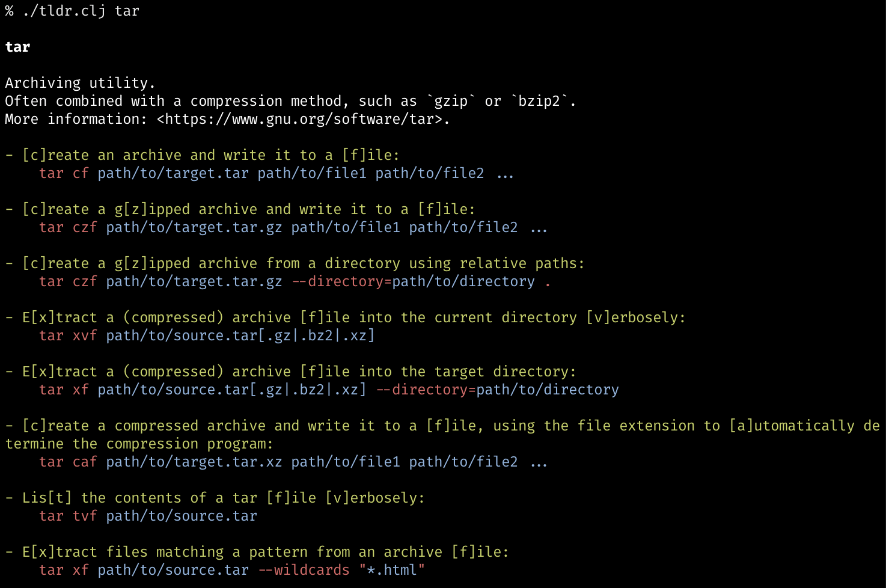

# tldr-bb-client

A [TLDR pages](https://tldr.sh/) client written in Babashka



## Getting Started

### Prerequisites

[Babashka](https://babashka.org/), Fast native Clojure scripting runtime.

On macOS:

```
brew install borkdude/brew/babashka
```

### Installation

Copy this command `tldr.clj` to a directory in your path. (~/bin, /usr/local/bin or somewhere)

```
chmod 755 tldr.clj
cp tldr.clj /usr/local/bin
tldr.clj
```

## Usage

```
usage: tldr.clj [OPTION]... PAGE

available commands:
  -h, --help           print this help and exit
  -u, --update         update local database
  -v, --version        print version and exit
  -c, --clear-cache    clear local database
  -V, --verbose        display verbose output
  -l, --list           list all entries in the local database
```

Examples:

```
tldr.clj tar
tldr.clj --list
```

To control the cache:

 ```
 tldr.clj --update
 tldr.clj --clear-cache
 ```

## Referenced projects

* [tldr](https://github.com/tldr-pages/tldr) - Simplified and community-driven man pages
* [tldr-c-client](https://github.com/tldr-pages/tldr-c-client) - C command-line client for tldr pages
* [tldr-node-client](https://github.com/tldr-pages/tldr-node-client) - Node.js command-line client for tldr pages
* [tldr-php](https://github.com/BrainMaestro/tldr-php) - PHP Client for tldr
* [tldr-planck](https://github.com/hisaitami/tldr-planck) - A planck (ClojureScript) based command-line client for TLDR pages

## License

Copyright (c) 2024 hisaitami

Distributed under the terms of the [MIT License](LICENSE)
